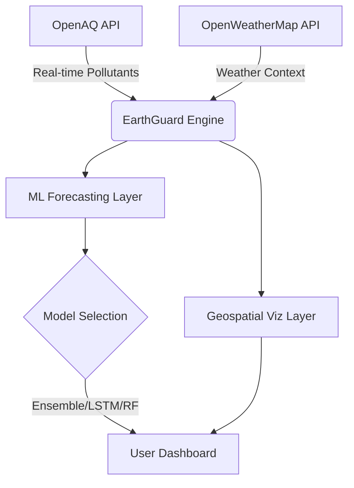

# 🌍 EarthGuard — Climate Digital Twin
### AI-Powered Planetary Health Intelligence Dashboard


---

**EarthGuard** is a high-fidelity Climate Digital Twin designed to democratize environmental data. Built for the **Pollution Control Problem Statement**, it bridges the gap between raw sensor data and actionable environmental policy through multi-algorithmic Machine Learning and real-time geospatial visualization.

## 🚀 Key Features

*   **🛰️ Real-Time Global Monitoring:** Integration with **OpenAQ v3 API**, tracking 10,000+ stations globally for PM2.5, NO₂, O₃, and more.
*   **🧠 Multi-Algorithm Forecasting:** Predicts air quality trends using an ensemble of 8 ML models (Ensemble, LSTM, XGBoost, etc.) directly in the browser.
*   **🗺️ Geospatial Intelligence:** Interactive high-resolution map with live color-coded station updates.
*   **📈 Advanced Analytics:** Includes hourly heatmaps, wind rose diagrams, and temperature-pollution correlation scatter plots.
*   **🏥 Health-Centric Alerts:** Personalized health impact assessments for 6 distinct population groups.
*   **📜 Policy Engine:** AI-derived policy recommendations based on localized AQI thresholds and pollutant profiles.

---

## 🛠️ Architecture & Tech Stack



*   **Frontend:** Vanilla JS, HTML5, CSS3 (Glassmorphism UI)
*   **Visualizations:** Chart.js, Leaflet.js
*   **Machine Learning:** Custom Pure JS implementation of 8 statistical and neural models.
*   **Data Sources:** OpenAQ (Pollution) & OpenWeatherMap (Atmospheric).

---

## 🚦 Getting Started

### 1. Prerequisites
- A modern web browser (Chrome, Firefox, Safari, Edge).
- API Keys: 
  - **OpenWeatherMap:** [Get Free Key](https://openweathermap.org/api)
  - **OpenAQ:** (No key required for base tier).

### 2. Local Setup
1. Clone the repository:
   ```bash
   git clone https://github.com/denny-mathew04/21_Zero-Shot_ACMNexus26.git
   ```
2. Open `index.html` in your browser.

> [!TIP]
> **Server Recommendation:** To avoid cross-origin (CORS) issues on some networks, run a simple local server:
> ```bash
> npx serve .
> ```

---

## 🤖 Forensic Machine Learning
EarthGuard compares 8 different models to find the most accurate prediction for the specific micro-climate selected:

| Model | Strengths |
|---|---|
| **Ensemble (Hybrid)** | Weighted average of all models; highest stability. |
| **LSTM** | Best for capturing temporal diurnal cycles. |
| **Random Forest** | Robust against outliers and non-linear sensor drift. |
| **XGBoost** | High-performance boosting for fast convergence. |
| **ARIMA** | Classic statistical time-series for seasonal trends. |
| **SVR / GBM / LR** | Linear and non-linear regression baselines. |

---

## 📁 Repository Structure
```text
aethertwin/
├── index.html          # Core interface
├── css/
│   └── style.css       # Professional glass-morphic styling
├── js/
│   ├── ml.js           # Core ML engine (LSTM, XGBoost, etc.)
│   ├── api.js          # REST integration for Data V3
│   ├── map.js          # Leaflet integration & clusters
│   ├── charts.js       # Analytical visualizations
│   └── app.js          # State management & orchestration
```

---

## 📊 US EPA Air Quality Index (AQI) Reference

| AQI Range | Category | Health Impact Note |
|---|---|---|
| **0 - 50** | 🟢 Good | Air quality is considered satisfactory. |
| **51 - 100** | 🟡 Moderate | Acceptable, though some risk for sensitive groups. |
| **101 - 150** | 🟠 Unhealthy (S.G.) | Members of sensitive groups may experience health effects. |
| **151 - 200** | 🔴 Unhealthy | Everyone may begin to experience health effects. |
| **201 - 300** | 🟣 Very Unhealthy | Health alert: everyone may experience serious effects. |
| **301+** | 🟤 Hazardous | Health warning of emergency conditions. |

---

## 🛣️ Roadmap
- [ ] **Mobile Native App:** Integration via React Native.
- [ ] **Satellite Data:** Sentinel-5P integration for NO2 plume tracking.
- [ ] **Hyper-Local IoT:** Support for private PurpleAir or custom sensor nodes.
- [ ] **Predictive Alerting:** Push notifications for forecasted hazards.

## 📄 License
Distributed under the MIT License. See `LICENSE` for more information.

---
**EarthGuard** • *Empowering Communities through Climate Data Transparency.*
